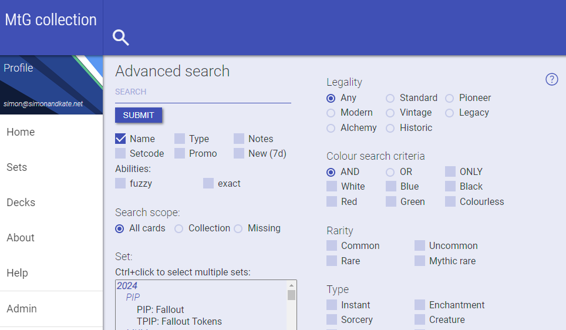
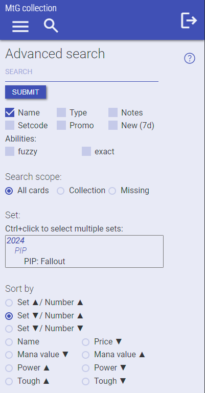

# README # (v 20/01/24)





## What is this? ##

This is a 'host your own' MtG collection-tracking website application for personal hosting. It is fully mobile-responsive.

NOTE: It is a work in progress, with varying levels of maturity of code in PHP, HTML, CSS, Javascript and MySQL reflecting my development journey across several years.

It uses the great work done at scryfall.com:

- card, set, legality and ruling databases in JSON form
- card images
- card pricing (obtained from TCGPlayer via Scryfall)

The site provides comprehensive search, collection tracking across all types of cards, localised currency conversion and full import/export capability.

Whilst due care and precautions have been taken to protect against known security issues, I make no guarantees that the work is without issues.
I can be reached at webmaster AT mtgcollection.info 

This has been developed using NetBeans 20, and runs for me on Red Hat Enterprise Linux 8 amd 9, with PHP 8.2 on a cloud VM with 2 x CPU and 6GB RAM.
Dependent on quantity of images downloaded, diskspace requirements can vary from <10GB to 100GB or more.

Note: The information presented about Magic: The Gathering is copyrighted by Wizards of the Coast. The website is not produced, endorsed, supported, or affiliated with Wizards of the Coast.
Thanks to:

- Andrew Gioia for his Keyrune project (https://keyrune.andrewgioia.com/)
- Scryfall for their great work which they make freely available (https://scryfall.com)

## WORK IN PROGRESS ##
- Lots to be done to automate and simplify
    - Groups admininstration
    - Site admin in admin pages, including email parameters
    - Ongoing tidy-up and code improvement
    - Some MTG-related tweaks, like Planes and Phenomena in decks
    - Setup script to automate first install as much as possible (initial setup is pretty much all manual at the moment)

## How do I get set up? ##

### Web server ###
Install under a full-function web server (e.g. Apache)

- e.g. git clone the master branch into /var/www/mtgc (I regularly break things in dev, and less regularly in master)
- See setup/mtgc.conf for sample Apache configuration file
- check and set all paths, names, IP addresses, certificates, etc.
- IMPORTANT: Sample config restricts bulk and setup folders to localhost access

On RHEL using php-fpm check the php-fpm config in /etc/php-fpm.d/www.conf

    php_admin_value[session.auto_start] = 0
    php_admin_value[session.use_cookies] = 1
    php_admin_value[session.use_only_cookies] = 1
    php_admin_value[session.cookie_httponly] = 1
    php_admin_value[session.cookie_secure] = 1
    php_admin_value[session.cookie_samesite] = Strict

If you want to, set a custom session.name in a copy of includes/sessionname_template.php named sessionname.local.php

Check web security settings etc. carefully and at your own risk. The settings are suggested only.

### Dependencies ###
#### Web server, domain name ####
It may seem obvious, but you will need to have access to a web server and a domain name to host the site.

This should include:

- command line console access
- ability to configure PHP in php.ini
- access to MySQL through e.g. phpMyAdmin or similar to be able to easily setup MySQL tables, etc.

You will also need access to install files into /opt.
If you are setting up email from this site, you will also need appropriate DNS access, etc. 

#### PHP ####
- Requires PHP 8.2
- requires php-gd for deck photo manipulation
- set upload_max_size and post_max to 25M (in php.ini)

#### MySQL ####
- Tested with MySQL version 8+
- Indexes are vital for performance, and are the difference between sub-1s and 5s+ searches
- cards_scry table should be InnoDB for best performance

#### JsonMachine ####
- See https://github.com/halaxa/json-machine
- Used for bulk script parsing
- Composer install (see below section)

#### PHPMailer ####
- See https://github.com/PHPMailer/PHPMailer
- Used for emails
- Composer install (see below section)
- Requires a functioning email environment - outside the scope of this install
- can use local SMTP host (default, no authentication)
- setup parameters in ini.php to configure other options

*If using direct SMTP from your own domain, you will likely need to learn about SPF, DKIM, DMARC etc. if you want your emails to be delivered*

#### Cloudflare Turnstile ####
- Used on login page to provide "captcha" style validation before login
- Setup Turnstile on a Cloudflare account to obtain keys
- Uses https://packagist.org/packages/andkab/php-turnstile Composer package
- If tier is "dev", dummy keys are used

To setup Turnstile

- Composer install (see below section)
- in Ini file (see section below on Ini file):
    - enable/disable (anything other than Turnstile = "enabled" will disable Turnstile functionality)
    - if enabled, you must set keys

#### JQuery ####
- Currently uses JQuery 3.7.1

#### Infinite Ajax Scroll ####
- See https://infiniteajaxscroll.com/
- Used in index.php
- Installed locally in /js folder
- Pulled down from CDN https://unpkg.com/@webcreate/infinite-ajax-scroll@3/dist/infinite-ajax-scroll.min.js

#### FreecurrencyAPI ####
- Composer install (see below section)
- Obtain API key from https://app.freecurrencyapi.com/. Free key has 10 per minute limit and 5,000 per month.
- Note, if [fx][FreecurrencyAPI] in ini file is empty, FX is disabled.
- See https://packagist.org/packages/everapi/freecurrencyapi-php Composer package
- The rate is updated at most every 60 minutes on demand, with the default currency set in ini file. Set to usd to disable conversion.

#### 2FA OTPHP ####
- Composer install (see below section)
- Provides QR-code and app-based 2FA management

#### Composer apps ####
Run composer from mtg directory on server

- composer require andkab/php-turnstile
- composer require everapi/freecurrencyapi-php:dev-master
- composer require halaxa/json-machine
- composer require phpmailer/phpmailer
- composer require spomky-labs/otphp

To install composer apps as apache: ```sudo -Hu apache composer require halaxa/json-machine```
To install all required: ```sudo -Hu apache composer update```

#### Disqus ####
The site can integrate Disqus commenting into card detail pages.
You will need to setup comments sites through https://www.disqus.com, 
set Disqus to enabled in your localised ini file (likely in /opt/mtg)
and add relevant Disqus site URLs.

### File locations ###
The app/site uses three filesystem locations:

- website files, typically hosted under /var/www
- application shell scripts, ini file - default is in /opt/mtg/
- log location, default is in /var/log/mtg

Setup:

- Create a new folder at /opt/mtg
- Copy the ini file from /setup (see next section) to /opt/mtg
- Copy the shell script samples from /setup to /opt/mtg, these are used to call bulk scripts
- Alter shell scripts as needed so they point to where the bulk scripts are located (e.g. default /var/www/mtgnew/bulk)
- Make sure the logfile location specified in the ini file exists and is web-server-writable (e.g. /var/log/mtg/mtgapp.log)
- Make sure the ImgLocation folder (see ini file) exists and is web-server-writable, and is presented to be served as 'cardimg' folder in Apache (I use a soft-link from /opt/mtg/cardimg to a drive with sufficient space)
- Make sure there is a web-server-readable/writeable json folder in the Imglocation folder (used for scryfall json files)

### Ini file ###
- The application expects an ini file located at: /opt/mtg/mtg_new.ini (path can be changed in ini.php if required)
- Your web server must be able to read AND write this file
- Setting 'tier' to dev or prod changes the header colour (dev - green, prod - blue)
- It must include:

Ini file content:

    [general]
    title       = "MtG collection"
    tier        = "prod"                            //either 'dev' or 'prod' to set Header colour
    ImgLocation = "/mnt/data/cardimg/"              //ensure web server can write here
    Logfile     = "/var/log/mtg/mtgapp.log"         //ensure web server can write here
    Loglevel    = 2                                 //see admin pages
    Timezone    = "Australia/Brisbane"
    Locale      = "en_US" 
    Copyright   = "Simon Wilson - 2024"
    URL         = "https://your-mtg-site-url.com"   //update to your actual URL
    
    [database]
    DBServer    = "********"
    DBUser      = "********"
    DBPass      = "********"
    DBName      = "********"
    
    [security]
    AdminIP              = ""
    Badloginlimit        = x
    Turnstile            = "disabled"
    Turnstile_site_key   = "xxxxxx"
    Turnstile_secret_key = "xxxxxx"
    TrustDuration        = 7
    
    [fx]
    FreecurrencyAPI = "YOUR-APIKEY"
    FreecurrencyURL = "https://api.freecurrencyapi.com/v1/latest?apikey="
    TargetCurrency  = "aud"
    
    [email]
    ServerEmail    = "no_reply@your-mtg-site-url.com"
    AdminEmail     = "youremail@youremail.com"
    SMTPDebug      = SMTP::DEBUG_OFF;
    Host           = 'localhost';
    SMTPAuth       = false;
    Username       = '';
    Password       = '';
    SMTPSecure     = PHPMailer::ENCRYPTION_SMTPS;
    Port           = 25;

    [comments]
    Disqus         = "disabled"
    DisqusDevURL   = "https://dev-url-here.disqus.com"
    DisqusDevURL   = "https://prod-url-here.disqus.com"


Before using:

- Check all variables, remove all comments in ini file
- All lines need to be fully left-aligned
- If Turnstile is enabled, valid keys must be included

NOTE: 
If AdminIP is empty, then an admin user can access admin pages from any IP address.
If AdminIP contains an IP address, then an admin user can access admin pages from
that IP address only.

### MySQL ###
Work to be done here to automate first setup.

- setup/mtg_new.sql contains database structure and initial index setup
- run the sql in your MySQL context


- Required database structure is in setup/mtg_new.sql
- You will need a MySQL user with access to the new 'mtg' database (see also [database] section of the ini file)
- You will need to run and import mtg_new.sql in your MySQL context
- You will also need:

In `admin` (administration) table:

    INSERT INTO `admin` (`key`, `usemin`, `mtce`) VALUES
    (1, 0, 0);

For groups to work (more work to be done here):

    INSERT INTO `groups` (`groupnumber`, `groupname`, `owner`) VALUES
    (1, 'Masters', 1);

Edit my.cnf and set as follows:
(first line is to remove GROUP BY, check existing server config and remove that, don't copy the line):

    [mysqld]
    sql_mode = STRICT_TRANS_TABLES,NO_ZERO_IN_DATE,NO_ZERO_DATE,ERROR_FOR_DIVISION_BY_ZERO,NO_ENGINE_SUBSTITUTION
    innodb_buffer_pool_size = 2G 

Note 2G sizing is based on 4G or more server RAM.

#### Initial database population ####
Check you have required database setup, and that the database user can use the database.

On the server's console, from the 'bulk' folder, run:

- ```php scryfall_bulk.php all```
- ```php scryfall_sets.php```
- ```php scryfall_rulings.php```
- ```php scryfall_migrations.php```

Note, the first bulk all load can take a VERY long time. Running with the 'all' parameter will NOT download any card images.

- It is important for the first bulk run to include 'all', otherwise the bulk script will attempt to download 80,000+ images in its first default run (Scryfall.com will likely have concerns about that)
- See also notes below on card images

### Initial user ###
On the server command line, run:

- ```php initial.php username password``` from webserver's console in the setup folder
- username is just FYI on the output, it's not used
- note the username and hashed password echoed back to the console
- in your MySQL write into the database for initial user
    - username
    - email
    - hashed password
    - reg_date (registration date)
    - status (active)
- I also suggest that you make the first user 'admin' using MySQL

### Cron jobs ###
Once database is setup and working, manually check and test-run the bulk scripts that you copied to /opt/mtg, and make sure they call and successfully run the scripts in the webserver's bulk folder

- bulk
- sets
- migrations
- rulings
- weekly

Setup cron jobs to run each bulk file and also weekly email file from /opt/mtg (run as root) and FX update script. Note the sets.sh file ensures that Apache has write access to the cardimg folder - check path and user.

### PAGE LOAD SEQUENCE ###

1. get and set session.name from sessionname.php or sessionname_template.php
2. Load ini.php
3. Ini.php sets:
    - class autoloader
    - reads in the ini file
    - checks the logfile is accessible and writable
    - establishes a mysqli database connection ($db)
    - sets the function for handling errors (mtg_error)
    - ... and exceptions (mtg_exception)
    - sets the writelog function (to be rewritten)
    - sets several arrays and variables to allow for changes to cards and types,
        which would otherwise need to be hard-coded into pages
4. Read in all functions from functions.php
5. Read in page variable set in secpagesetup.php
    - css version
    - check the user is logged in
    - get the user name
    - get user email
    - get the user's collection table
    - check if the site is in maintenance mode, and if it is: trigger a message and logout
6. Load page and framework (header, page content, overlays, menu, footer)

### Notes on card images ###
- The initial database population with the 'all' parameter will NOT download any card images. 
- Subsequent 'default' (by default nightly) runs will download images for cards added.
- Sets can have card image downloads triggered on the sets page by admin users.
- Otherwise, each card image will be downloaded when required by the site

### Notes on data management ###
- All cards, all languages are pulled down and imported
- The primary language is English and by default searching will search these cards
- Cards where the primary language is not English will be included in default searches
- Non-primary language cards can be included by main page drop-down selection
- Bulk import can be set to exclude anguages in bulk/bulk_ini.php
- By default cards which have either a paper version or an Arena version are imported
- Scryfall corrections (e.g. deletions) are implemented unless those cards are in someone's collection or decks
    - If in collections or decks, a report will be sent to the site admin email, and will be visible on the site admin page

### Notes on currency FX ###
- USD will always be shown as the primary currency
- The default currency for the site can be set in the ini file
- If it's set to usd, conversion is not enabled
- FX conversion can be set to specific currencies per user in user profile settings

© Simon Wilson, 2024