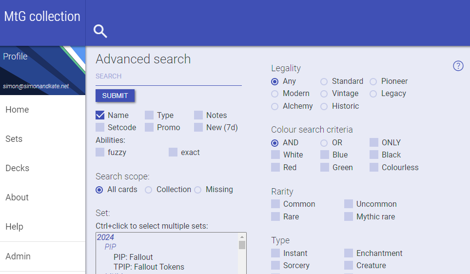
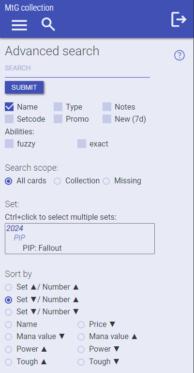

# README (v 20/01/24)

## Index

- [Description](#description)
- [Install Options](#install-options)
- [Dependencies](#dependencies)
- [Configuration & Admin Settings](#configuration--admin-settings)
- [Work In Progress](#work-in-progress)
- [Credits](#credits)

## Description

This is a "host your own" MtG collection-tracking website application. It is
fully mobile-responsive and offers comprehensive search, collection tracking,
localised currency conversion, import/export tooling, and optional 2FA and
commenting integrations.

The app relies on data provided by Scryfall (sets/cards/rulings/prices/images).
While due care is taken, no security guarantees are provided. The site is
currently developed on RHEL 8/9 with PHP 8.2; disk usage ranges from <10 GB to
>100 GB depending on downloaded images.

## Install Options

- **Bare Metal / Native** – See [INSTALL.md](INSTALL.md) for Apache/PHP/MySQL
  deployment instructions (vhosts, php-fpm, cron jobs, etc.).
- **Docker / Podman** – See [DOCKER.md](DOCKER.md) for the container workflow
  using `docker/docker-init.sh` (Linux/macOS/WSL) or `docker/docker-init.bat`
  (Windows). The scripts manage `.env`, permissions, admin setup, and bulk data
  imports.

## Dependencies

### Web stack

- Web server (e.g. Apache) with CLI access and ability to configure PHP/MySQL.
- PHP 8.2 with extensions: `mysqli`, `gd`, `mbstring`, `intl`, `curl`.
- PHP settings: `upload_max_filesize`/`post_max_size` ≥ 25 M; secure session
  cookie settings (HTTPOnly, Secure, SameSite=Strict).
- MySQL 8+ (InnoDB tables, proper indexing for performance).
- Optional: php-fpm tuning as described in INSTALL.md.

### Composer packages

Install as the web user (e.g. `sudo -Hu apache composer install`). Required
packages:

- `andkab/php-turnstile` (Cloudflare Turnstile)
- `everapi/freecurrencyapi-php`
- `halaxa/json-machine`
- `phpmailer/phpmailer`
- `spomky-labs/otphp`
- `endroid/qr-code`
- Dev: `phpunit/phpunit`

### Front-end libraries & services

- jQuery 3.7.1
- Infinite Ajax Scroll (bundled in `/js`)
- Cloudflare Turnstile (optional; requires site/secret keys)
- FreecurrencyAPI (optional; empty key disables FX)
- Disqus (optional; configure via ini)

### Optional integrations

- SMTP email infrastructure (PHPMailer). For direct senders, configure SPF/DKIM/
  DMARC.
- Disqus commenting, configured per ini.

## Configuration & Admin Settings

### File locations

- Web root (e.g. `/var/www/mtgnew`).
- Application config/scripts: `/opt/mtg` by default. Copy `setup/mtg_new.ini`
  and `setup/*.sh` here, adjust script paths, and make them executable.
- Logs under `/var/log/mtg` (e.g. `mtgapp.log`). Ensure the web user or
  container user can write to them.
- `ImgLocation` (configured in the ini) stores card images and cached JSON; it
  must exist, be writable, and include a writable `json` subfolder.

### Ini file (`/opt/mtg/mtg_new.ini`)

- `[general]` section defines title, tier (`dev`/`prod` header colours),
  `ImgLocation`, `Logfile`, `Loglevel`.
- Additional sections for SMTP/PHPMailer settings, Turnstile keys,
  FreecurrencyAPI key, Disqus settings, FX defaults, etc.
- Web/container users must have read/write access; admin UI writes back changes.

### Shell/Bulk scripts

- Sample scripts in `setup/*.sh` should be copied to `/opt/mtg/scripts` (or your
  chosen location) and updated to point to the bulk directory.
- Schedule via cron/Task Scheduler to keep data, prices, and weekly exports up
  to date.

## Work In Progress

- Further automation/simplification of admin flows
- Additional MTG-specific tweaks (Planes, Phenomena, etc.)

## Credits

- Andrew Gioia for [Keyrune](https://keyrune.andrewgioia.com/)
- [Scryfall](https://scryfall.com) for card/set/ruling/pricing data and images
- Wizards of the Coast for Magic: The Gathering (not affiliated)

Contact: webmaster@mtgcollection.info
