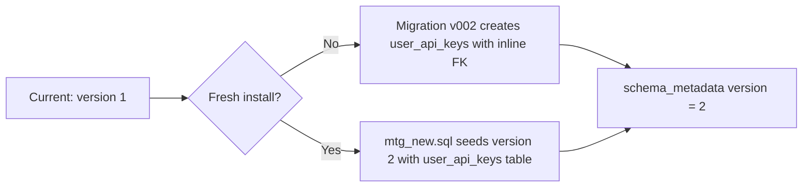
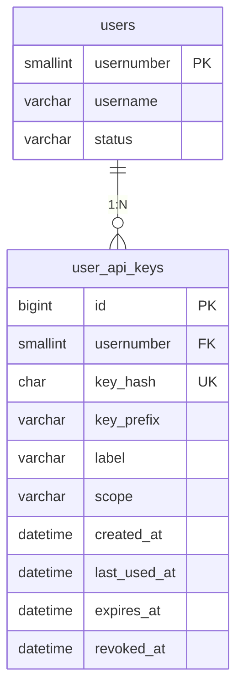

# Plan: API Keys Schema Artifacts (Phase 1a Only)

## Scope

This plan covers **only** the database schema artifacts needed to support the API key system described in `local/mcp-api-access-keys.md`. Specifically:

- The `user_api_keys` table definition
- Migration file to upgrade existing installations
- Fresh-install schema additions to `setup/mtg_new.sql`
- Schema verification tests

**Out of scope (future phases, not coded here):**
- `ApiKeyManager` class
- `ApiKeyPrincipal` class
- API endpoints
- Profile UI changes
- Authentication flow changes
- Any changes to existing entrypoints
- CHANGELOG.md (reserved for Phase 5 when feature ships)

---

## 1. Existing Framework Analysis

### Schema Version Tracking

The application uses a versioned migration system:

```
Current state: schema_metadata.schema_version = 1
Next version:  schema_metadata.schema_version = 2
```

The `MigrationRunner` class (`src/MTG/Bulk/MigrationRunner.php`) handles:

- File discovery via `glob('setup/schema_v*.sql')`
- Version gap detection (rejects if versions are not sequential 1..N)
- Duplicate version rejection (fatal error)
- Malformed filename rejection (must be `schema_vNNN.sql` or `schema_vNNN_<name>.sql`)
- Advisory locking for concurrent runner prevention
- Maintenance mode toggle during migration
- Per-migration version verification after execution
- Final version verification

### Migration File Convention

Each migration file follows this structure (from [`docs/SCHEMA_UPDATES.md`](docs/SCHEMA_UPDATES.md)):

1. Header block with version, migration ID, date, purpose, bundled release
2. Prerequisites section
3. Deployment sequencing notes
4. UTC timezone setup
5. Schema changes (DDL)
6. Version bump: `UPDATE schema_metadata SET schema_version = N WHERE id = 1 AND schema_version = N-1`
7. Completion message
8. Rollback section (commented)

### Fresh-Install Schema Convention

Fresh installations use [`setup/mtg_new.sql`](setup/mtg_new.sql) which includes all schema objects. The convention is:

- **Tables are created first** with their own columns, primary keys, and local indexes — but **cross-table foreign-key constraints are NOT defined inline in CREATE TABLE**.
- **ALTER TABLE constraint blocks** at the end of the file add cross-table FK constraints (e.g., `fk_collection_values_user` for `collection_values`).
- The `schema_metadata` table is seeded with `schema_version = NNN` (current version).

The `user_api_keys` FK must follow this existing convention: CREATE TABLE without the FK inline, then ADD CONSTRAINT in the ALTER TABLE section later.

### Test Convention

Schema tests follow the pattern in [`tests/SchemaMetadataTest.php`](tests/SchemaMetadataTest.php):

- Read SQL files as text
- Assert presence of expected SQL constructs (CREATE TABLE, INSERT, column definitions)
- Use regex extraction for CREATE TABLE blocks
- Verify column types, constraints, indexes, foreign keys

---

## 2. Database Schema Design

### 2.1 Table: `user_api_keys`

Based on the requirements document, the table structure is:

```sql
CREATE TABLE `user_api_keys` (
  `id` BIGINT UNSIGNED NOT NULL AUTO_INCREMENT,
  `usernumber` SMALLINT NOT NULL,
  `key_hash` CHAR(64) CHARACTER SET ascii COLLATE ascii_bin NOT NULL,
  `key_prefix` VARCHAR(23) CHARACTER SET ascii COLLATE ascii_bin NOT NULL,
  `label` VARCHAR(128) DEFAULT NULL,
  `scope` VARCHAR(64) CHARACTER SET ascii COLLATE ascii_bin NOT NULL DEFAULT 'collection:read',
  `created_at` DATETIME NOT NULL,
  `last_used_at` DATETIME DEFAULT NULL,
  `expires_at` DATETIME DEFAULT NULL,
  `revoked_at` DATETIME DEFAULT NULL,
  PRIMARY KEY (`id`),
  UNIQUE KEY `uq_user_api_keys_hash` (`key_hash`),
  KEY `idx_user_api_keys_owner` (`usernumber`, `revoked_at`),
  KEY `idx_user_api_keys_last_used` (`last_used_at`)
) ENGINE=InnoDB DEFAULT CHARSET=utf8mb4 COLLATE=utf8mb4_general_ci;
```

**Note:** The FK constraint is NOT defined inline. It is added later via ALTER TABLE in the fresh-install schema, following the existing convention.

### 2.2 Column Rationale

| Column | Type | Rationale |
|--------|------|-----------|
| `id` | BIGINT UNSIGNED AUTO_INCREMENT | Surrogate key; BIGINT for future scale |
| `usernumber` | SMALLINT NOT NULL | Matches `users.usernumber` exactly (SMALLINT). NOT NULL because a key must always belong to a user. |
| `key_hash` | CHAR(64) ASCII | SHA-256 produces 32 bytes = 64 hex chars. ASCII collation for case-sensitive, byte-level comparison. UNIQUE for efficient unique indexed lookup during authentication. |
| `key_prefix` | VARCHAR(23) ASCII | `mtg_ak_` (7 chars) + 16 hex chars = 23 chars. Display-only; not used for lookups. ASCII collation. |
| `label` | VARCHAR(128) NULL | User-provided friendly name. Nullable for keys created without a label. Validation/normalisation belongs in ApiKeyManager/profile handling later. |
| `scope` | VARCHAR(64) ASCII | Initially only `'collection:read'`. ASCII collation. Reserved for future scopes. |
| `created_at` | DATETIME NOT NULL | Key creation time. Set to `UTC_TIMESTAMP()` at creation. |
| `last_used_at` | DATETIME NULL | Last authentication time. Nullable until first use. Updated with throttling (at most once per 5 min per key). |
| `expires_at` | DATETIME NULL | Expiry time. NULL means no expiry. Checked during authentication. |
| `revoked_at` | DATETIME NULL | Revocation time. NULL means active. Used as the active-state check. |

### 2.3 Index Strategy

| Index | Type | Purpose |
|-------|------|---------|
| `PRIMARY KEY (id)` | Primary | Surrogate key lookup |
| `uq_user_api_keys_hash (key_hash)` | Unique | Authentication lookup: efficient unique indexed lookup by hash |
| `idx_user_api_keys_owner (usernumber, revoked_at)` | Composite | Profile listing: find active keys for a user. Composite with `revoked_at` allows filtering active keys in a single index scan. |
| `idx_user_api_keys_last_used (last_used_at)` | Single | Maintenance/audit queries for stale keys |

**Note:** No `(expires_at, revoked_at)` index is added now. Nothing in Phase 1 requires bulk expiry cleanup; authentication is located by the unique key_hash first, so expiry/revocation are evaluated on a single retrieved row. An extra index would be speculative. If a scheduled cleanup/reporting job is later implemented, add an index based on the actual query.

### 2.4 Foreign Key

| Constraint | Reference | Behavior |
|------------|-----------|----------|
| `fk_user_api_keys_user` | `users.usernumber` | `ON DELETE CASCADE` -- user deletion removes all their keys automatically |

**Type match:** `user_api_keys.usernumber` (SMALLINT) matches `users.usernumber` (SMALLINT). No type mismatch.

**Fresh-install convention:** The FK is added via ALTER TABLE, not inline in CREATE TABLE. This avoids defining the same named constraint twice, which MySQL rejects as an error.

### 2.5 Collation Notes

- `key_hash`, `key_prefix`, and `scope` use `CHARACTER SET ascii COLLATE ascii_bin` for:
  - Byte-level comparison (no Unicode normalization concerns)
  - Consistent case-sensitive matching for the raw key hash
  - Minimal storage (1 byte per character vs 4 bytes for utf8mb4)
- The table default is `utf8mb4 COLLATE utf8mb4_general_ci` for other columns.

---

## 3. Artifacts to Create/Modify

### 3.1 Migration File: `setup/schema_v002.sql`

**File:** `setup/schema_v002.sql`

**Version:** 2 (next after v001)

**Content structure:**

```sql
-- ============================================================
-- Schema update: version 1 -> 2
-- Migration ID: 202609170001
-- Date: 2026-09-17
-- Purpose: Add user_api_keys table for API key management
-- Bundled with release: TBD
-- ============================================================
-- MySQL DDL auto-commits. Do not wrap in a transaction.
-- ============================================================
--
-- Prerequisites:
--   - MySQL 8+ server.
--   - Current schema version must be 1.
--   - Database user must have:
--       CREATE privilege for the new table,
--       REFERENCES privilege on the users table for the foreign key,
--       UPDATE privilege on schema_metadata for the version bump.
--
-- Deployment sequencing:
--   1. Verify current schema version: SELECT schema_version FROM schema_metadata LIMIT 1;
--   2. Apply this migration.
--   3. Verify: SELECT schema_version FROM schema_metadata LIMIT 1; (should be 2)
--
-- Fresh-install note:
--   Fresh installations do not need this migration. The user_api_keys
--   table is included in setup/mtg_new.sql.
--
-- Existing table handling:
--   If user_api_keys already exists while schema_metadata.version is still 1,
--   treat this as a possible partial or manual migration. Stop and investigate
--   before proceeding.
--
-- To run manually:
--   mysql -u <user> -p mtg_new < setup/schema_v002.sql
--

-- ============================================================
-- Set UTC time zone for deterministic timestamps
-- ============================================================

SET time_zone = '+00:00';

-- ============================================================
-- Create user_api_keys table (FK inline is valid here because
-- the users table already exists in the database)
-- ============================================================

CREATE TABLE `user_api_keys` (
  `id` BIGINT UNSIGNED NOT NULL AUTO_INCREMENT,
  `usernumber` SMALLINT NOT NULL,
  `key_hash` CHAR(64) CHARACTER SET ascii COLLATE ascii_bin NOT NULL,
  `key_prefix` VARCHAR(23) CHARACTER SET ascii COLLATE ascii_bin NOT NULL,
  `label` VARCHAR(128) DEFAULT NULL,
  `scope` VARCHAR(64) CHARACTER SET ascii COLLATE ascii_bin NOT NULL DEFAULT 'collection:read',
  `created_at` DATETIME NOT NULL,
  `last_used_at` DATETIME DEFAULT NULL,
  `expires_at` DATETIME DEFAULT NULL,
  `revoked_at` DATETIME DEFAULT NULL,
  PRIMARY KEY (`id`),
  UNIQUE KEY `uq_user_api_keys_hash` (`key_hash`),
  KEY `idx_user_api_keys_owner` (`usernumber`, `revoked_at`),
  KEY `idx_user_api_keys_last_used` (`last_used_at`),
  CONSTRAINT `fk_user_api_keys_user`
    FOREIGN KEY (`usernumber`) REFERENCES `users` (`usernumber`)
    ON DELETE CASCADE
) ENGINE=InnoDB DEFAULT CHARSET=utf8mb4 COLLATE=utf8mb4_general_ci;

-- ============================================================
-- Version bump
-- ============================================================

UPDATE schema_metadata SET schema_version = 2 WHERE id = 1 AND schema_version = 1;

SELECT 'Schema version bumped to 2. Migration complete.' AS info;

-- ============================================================
-- ROLLBACK (destructive — use only before first use or with
-- verified backup)
-- ============================================================
-- DROP TABLE `user_api_keys`;
-- UPDATE schema_metadata SET schema_version = 1;
-- ============================================================
```

**Key design decisions:**
- Uses `SET time_zone = '+00:00'` for UTC consistency (matches v001 pattern)
- No `IF NOT EXISTS` -- the migration runner expects deterministic DDL
- FK constraint is defined inline in CREATE TABLE (valid because the migration runs against an existing database where `users` already exists)
- Version bump uses `WHERE schema_version = 1` for optimistic locking
- Rollback section is commented and follows the documented pattern
- **Prerequisites note:** Removed the MySQL 8.0.16 CHECK constraint justification -- this migration contains no CHECK constraint. The general MySQL 8+ requirement stands if independently documented by the application.

---

### 3.2 Fresh-Install Schema: `setup/mtg_new.sql`

**File:** `setup/mtg_new.sql`

**Changes:**

1. **Insert the `user_api_keys` table definition** after the `users` table definition (line ~377) and before `collection_values` (line ~379). **The CREATE TABLE does NOT include the FK constraint inline.** This follows the existing fresh-install convention.

2. **Add the ALTER TABLE constraint section** for the foreign key after the existing ALTER TABLE sections (after the `fk_collection_values_user` block). This adds the FK constraint separately, matching the existing pattern.

3. **Update `schema_metadata` seed** from `(1, 1)` to `(1, 2)` to reflect that fresh installations start at version 2.

**Specific insertion points:**

**Insertion 1 -- Table definition** (after `users` table, before `collection_values`):

```sql
CREATE TABLE `user_api_keys` (
  `id` BIGINT UNSIGNED NOT NULL AUTO_INCREMENT,
  `usernumber` SMALLINT NOT NULL,
  `key_hash` CHAR(64) CHARACTER SET ascii COLLATE ascii_bin NOT NULL,
  `key_prefix` VARCHAR(23) CHARACTER SET ascii COLLATE ascii_bin NOT NULL,
  `label` VARCHAR(128) DEFAULT NULL,
  `scope` VARCHAR(64) CHARACTER SET ascii COLLATE ascii_bin NOT NULL DEFAULT 'collection:read',
  `created_at` DATETIME NOT NULL,
  `last_used_at` DATETIME DEFAULT NULL,
  `expires_at` DATETIME DEFAULT NULL,
  `revoked_at` DATETIME DEFAULT NULL,
  PRIMARY KEY (`id`),
  UNIQUE KEY `uq_user_api_keys_hash` (`key_hash`),
  KEY `idx_user_api_keys_owner` (`usernumber`, `revoked_at`),
  KEY `idx_user_api_keys_last_used` (`last_used_at`)
) ENGINE=InnoDB DEFAULT CHARSET=utf8mb4 COLLATE=utf8mb4_general_ci;
```

**Insertion 2 -- Schema metadata seed update:**

Change:
```sql
INSERT INTO `schema_metadata` (`id`, `schema_version`) VALUES (1, 1);
```
To:
```sql
INSERT INTO `schema_metadata` (`id`, `schema_version`) VALUES (1, 2);
```

**Insertion 3 -- Foreign key constraint** (after `fk_collection_values_user` block, before `COMMIT;`):

```sql
ALTER TABLE `user_api_keys`
  ADD CONSTRAINT `fk_user_api_keys_user`
    FOREIGN KEY (`usernumber`) REFERENCES `users` (`usernumber`)
    ON DELETE CASCADE;
```

**Critical:** The FK constraint name `fk_user_api_keys_user` must appear **exactly once** in the fresh-install schema. Defining it both inline in CREATE TABLE and in ALTER TABLE is a MySQL error (duplicate constraint symbol). The pattern above defines it only in ALTER TABLE.

---

### 3.3 Schema Verification Test: `tests/SchemaApiKeysTest.php`

**File:** `tests/SchemaApiKeysTest.php`

**Purpose:** Verify that both the migration file and the fresh-install schema contain the correct `user_api_keys` table definition, columns, indexes, and foreign key. Also verify that the fresh-install schema does not define the FK constraint twice.

**Test cases:**

| Test | What it verifies |
|------|-----------------|
| `testFreshInstallContainsUserApiKeysTable` | `mtg_new.sql` contains `CREATE TABLE user_api_keys` |
| `testMigrationContainsUserApiKeysTable` | `schema_v002.sql` contains `CREATE TABLE user_api_keys` |
| `testFreshInstallSchemaMetadataVersionIsTwo` | `mtg_new.sql` seeds `schema_version = 2` |
| `testFreshInstallUserApiKeysColumns` | All 10 columns present with correct types |
| `testMigrationUserApiKeysColumns` | All 10 columns present with correct types |
| `testFreshInstallUserApiKeysIndexes` | Primary key, unique hash index, composite owner index, last_used index |
| `testMigrationUserApiKeysIndexes` | Same index verification for migration |
| `testFreshInstallUserApiKeysForeignKey` | FK to `users.usernumber` with CASCADE via ALTER TABLE |
| `testMigrationUserApiKeysForeignKey` | Same FK verification for migration |
| `testFreshInstallUserApiKeysAsciiCollation` | `key_hash`, `key_prefix`, `scope` use ASCII binary collation |
| `testMigrationUserApiKeysAsciiCollation` | Same ASCII collation verification for migration |
| `testMigrationContainsVersionBump` | Migration contains `UPDATE schema_metadata SET schema_version = 2` |
| `testMigrationContainsRollbackSection` | Migration contains commented rollback |
| `testMigrationContainsUtcSetup` | Migration contains `SET time_zone = '+00:00'` |
| `testFreshInstallDefinesFkExactlyOnce` | `mtg_new.sql` contains `ADD CONSTRAINT fk_user_api_keys_user` exactly once (catches duplicate FK definition) |
| `testFreshInstallDoesNotDefineFkInline` | `mtg_new.sql` CREATE TABLE block for `user_api_keys` does NOT contain `CONSTRAINT fk_user_api_keys_user` (verifies FK is only in ALTER TABLE) |

**Pattern:** Each test reads the SQL file as a string and uses `assertStringContainsString()` or regex extraction to verify the presence of expected constructs. This matches the pattern in [`tests/SchemaMetadataTest.php`](tests/SchemaMetadataTest.php).

---

## 4. File Change Summary

| Action | File | Change |
|--------|------|--------|
| **Create** | `setup/schema_v002.sql` | Migration file: CREATE TABLE with inline FK + version bump |
| **Modify** | `setup/mtg_new.sql` | Add `user_api_keys` CREATE TABLE (no inline FK), update version seed to 2, add FK via ALTER TABLE |
| **Create** | `tests/SchemaApiKeysTest.php` | 16 test cases verifying schema correctness in both files |
| **Do not modify** | `CHANGELOG.md` | Reserved for Phase 5 when the feature is implemented and shipped |

---

## 5. Schema Version Flow



---

## 6. Data Model Relationships



---

## 7. Security Considerations

| Concern | Mitigation |
|---------|-----------|
| Key hash storage | SHA-256 hash stored; raw key never persisted |
| Collision resistance | 256-bit random entropy via `bin2hex(random_bytes(32))`; unique index catches collisions |
| User isolation | FK with CASCADE; authentication queries filter by `key_hash` only |
| Orphan prevention | `ON DELETE CASCADE` ensures keys are removed when user is deleted |
| ASCII collation | Prevents Unicode normalization attacks on hash/prefix columns |
| Index on (usernumber, revoked_at) | Enables efficient active-key counting and listing per user |

---

## 8. Implementation Checklist

When the plan is approved, the implementation steps are:

1. [ ] Create `setup/schema_v002.sql` with the migration DDL
2. [ ] Modify `setup/mtg_new.sql`:
   - Add `user_api_keys` CREATE TABLE (no inline FK) after `users` table
   - Update `schema_metadata` seed to version 2
   - Add FK constraint via ALTER TABLE in the constraint section
3. [ ] Create `tests/SchemaApiKeysTest.php` with 16 schema verification tests
4. [ ] Run the real migration (schema_v002.sql) against a test database via MigrationRunner
5. [ ] Validate the fresh-install schema parses and applies without errors
6. [ ] Run PHPCS on any new PHP files
7. [ ] Run the full PHPUnit suite to confirm no regressions
